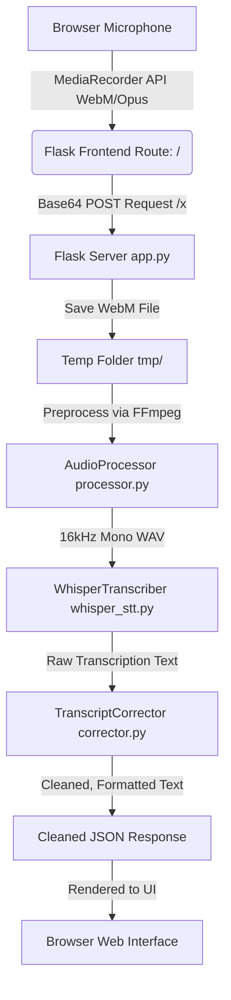

# Project Overview: Speech-to-Text Transcriber

A modern, high-performance local web application that records audio via the browser, converts it using FFmpeg, transcribes it using **Faster-Whisper** on CPU, and polishes the text with an automated transcription correction pipeline.

---

## 1. System Architecture & Flow

The system operates as a single-page web application communicating with a Flask-based backend server. The end-to-end data flow is described below:



1. **User Interaction**: The user toggles recording in a premium glassmorphic UI.
2. **Audio Capture**: The browser captures audio using `MediaRecorder` and encodes it (typically WebM/Opus).
3. **Transmission**: The recording is converted to base64 and POSTed to the `/x` Flask endpoint.
4. **Decoding & Temp Save**: The backend decodes the base64 payload and writes a temporary `.webm` file.
5. **Preprocessing (FFmpeg)**: [processor.py](file:///c:/Users/ambik/Downloads/Agentic%20AI/speech_to_text/audio/processor.py) invokes `ffmpeg` to resample the audio to 16kHz mono `s16` WAV format. It checks the root mean square (RMS) energy to ensure a minimum threshold of speech activity exists.
6. **Inference (Faster-Whisper)**: The WAV file is fed into [whisper_stt.py](file:///c:/Users/ambik/Downloads/Agentic%20AI/speech_to_text/transcription/whisper_stt.py). The model uses CPU-optimized int8 quantization to perform fast local inference.
7. **Post-Processing**: The raw text goes to [corrector.py](file:///c:/Users/ambik/Downloads/Agentic%20AI/speech_to_text/transcription/corrector.py) to strip fillers, fix colloquial contractions, remove stutters, and format sentence punctuation.
8. **Clean-up**: Temporary `.webm` and `.wav` files are unlinked.
9. **UI Display**: The formatted transcript is returned and shown on the web page.

---

## 2. Directory Structure

Here is an overview of the code organization:

*   **[main.py](file:///c:/Users/ambik/Downloads/Agentic%20AI/speech_to_text/main.py)**: The application entry point. Parses command line arguments, preloads the configured Whisper model, and launches the Flask server.
*   **[config.py](file:///c:/Users/ambik/Downloads/Agentic%20AI/speech_to_text/config.py)**: Configures global variables (ports, hostnames, audio parameters) loaded from environment variables.
*   **[ui/](file:///c:/Users/ambik/Downloads/Agentic%20AI/speech_to_text/ui)**
    *   **[app.py](file:///c:/Users/ambik/Downloads/Agentic%20AI/speech_to_text/ui/app.py)**: Defines `DictateApp`. Houses the embedded HTML/CSS/JS frontend template and the `/x` POST handler.
*   **[audio/](file:///c:/Users/ambik/Downloads/Agentic%20AI/speech_to_text/audio)**
    *   **[processor.py](file:///c:/Users/ambik/Downloads/Agentic%20AI/speech_to_text/audio/processor.py)**: Manages audio conversions using subprocess calls to FFmpeg. Performs voice activity checks (RMS).
*   **[transcription/](file:///c:/Users/ambik/Downloads/Agentic%20AI/speech_to_text/transcription)**
    *   **[whisper_stt.py](file:///c:/Users/ambik/Downloads/Agentic%20AI/speech_to_text/transcription/whisper_stt.py)**: Caches and runs the `faster-whisper` machine learning model.
    *   **[corrector.py](file:///c:/Users/ambik/Downloads/Agentic%20AI/speech_to_text/transcription/corrector.py)**: Sanitizes transcripts using regular expression pattern matching.
*   **[utils/](file:///c:/Users/ambik/Downloads/Agentic%20AI/speech_to_text/utils)**
    *   **[helpers.py](file:///c:/Users/ambik/Downloads/Agentic%20AI/speech_to_text/utils/helpers.py)**: Utility functions for path names, MD5 hashes, and durations.
*   **[Dockerfile](file:///c:/Users/ambik/Downloads/Agentic%20AI/speech_to_text/Dockerfile) / [docker-compose.yml](file:///c:/Users/ambik/Downloads/Agentic%20AI/speech_to_text/docker-compose.yml)**: Docker support for containerized execution.

---

## 3. Detailed Component Breakdown

### A. Frontend Web UI (Glassmorphic Design)
*   **Design**: Features a vibrant, modern dark-theme styling palette, premium animations, a pulse ring indicator during recording, and a responsive fluid canvas wave visualizer.
*   **Theme Control**: Toggleable between Dark Mode and Light Mode, with state preserved in local storage.
*   **Micro-interactions**: Subtle hover/click animations on the microphone button, loading spinners, clipboard copying, and responsive resizing.

### B. Audio Preprocessor
*   FFmpeg conversion format: `ffmpeg -y -i <input> -ar 16000 -ac 1 -sample_fmt s16 <output.wav>`
*   Speech detection: Discards clips shorter than 0.3 seconds or below `MIN_RMS = 0.003` (root mean square energy) to prevent sending empty noise to Whisper.

### C. Faster-Whisper Inference
*   Loads the configured Whisper model size (`tiny`, `base`, `small`, `medium`, or `large`).
*   Runs on CPU using `int8` quantization, providing a great speed improvement over vanilla PyTorch implementations.
*   Uses a beam size of 1 for high-speed local performance.

### D. Transcript Corrector
*   **Fillers Removed**: Strips "um", "uh", "hmm", "uhh", "ah", "mm", etc.
*   **Grammar Alignment**: Replaces common spoken shorthand:
    *   *Slang*: `gonna` -> `going to`, `wanna` -> `want to`
    *   *Contractions*: `dont` -> `do not`, `i'm` -> `I am`, `it's` -> `it is`
*   **Dysfluency Removal**: Cleans stuttered letters (`l-l-like` -> `like`) and repeated consecutive words.
*   **Punctuation**: Ensures sentences end with proper final punctuation and are appropriately capitalized.

---

## 4. Setup and Execution

### Requirements
- **Python**: version 3.11 recommended.
- **FFmpeg**: Must be installed and present in the system's execution PATH.

### Installation
Install dependencies via pip:
```bash
pip install -r requirements.txt
```

### Running Locally
To launch the application, run:
```bash
python main.py --model tiny
```
*Note: The default model size is `small`. Using `--model tiny` is recommended for systems with limited RAM/CPU resources for faster start time.*

The console will indicate once the model is loaded and display:
```
Open: http://localhost:7865
```
